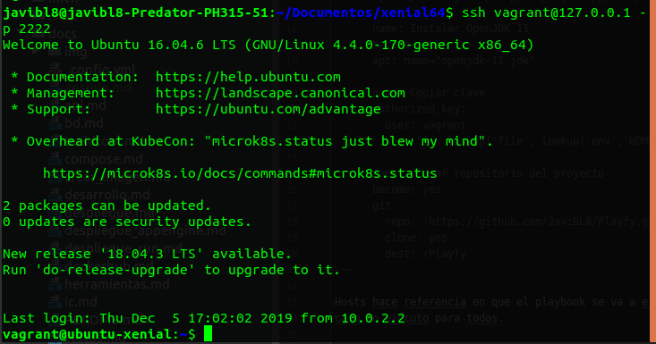

## Provisionamiento con Ansible

Para realizar el provisionamiento he creado un playbook que se ejecute cada vez que
se realice vagrant up/reload. A continuación paso a describirlo: 
~~~
- hosts: all
  tasks:
    - name: Instalar Git
      become: yes
      apt: name=git state=installed update_cache=true

    - name: Añadir el repositorio Java de Oracle
      become: yes
      apt_repository: repo='ppa:openjdk-r/ppa' update_cache=true

    - name: Instalar OpenJDK 11
      become: yes
      apt: name="openjdk-11-jdk"

    - name: Copiar clave
      authorized_key: 
        user: vagrant
        key: "{{  lookup('file', lookup('env','HOME') + '/.ssh/id_rsa.pub') }}"
    
    - name: Clonar repositorio del proyecto
      become: yes
      git:
        repo: 'https://github.com/JaviBL8/Playfy.git'
        clone: yes
        dest: /Playfy
~~~

Hosts hace referencia en que el playbook se va a ejecutar para los siguientes hosts, en mi 
caso lo ejecuto para todos.

Tasks son todas las tareas que deseamos que Ansible ejecute. Primero se instala git usando apt,
después añado el repositorio de Java y con update caché se consigue lo mismo que con `apt update`
Una vez se ha añadido correctamente se instala el OpenJDK necesario para correr Playfy. 
Ahora paso a realizar una copia de la clave pública haciendo uso de la variable de entorno que
proporciona Ubuntu **$HOME** y dentro de ese directorio encontramos .ssh que almacena las claves ssh.
Esto hará que se pueda acceder de forma más segura a la MV mediante ssh.

Por último realizo un clonado del repositorio y lo guardo en un directorio cuyo nombre será
"Playfy". Aquí finalizaría el provisionamiento con Ansible, aunque también he puesto en marcha
la aplicación pero eso ya lo explico [aquí](vagrant.md).

Finalmente, me gustaría añadir que instalar Maven es posible y que aunque yo por comodidad y 
especificidad usaré el wrapper de Maven para lanzar las ejecuciones dejo aquí el proceso para
poder usar Maven en el terminal ya que realicé pruebas con eĺ también.

~~~
    - name: Comprueba que Maven esté instalado
      stat:
        path: /opt/maven
      register: stat_result

    - name: Descarga y descomprime maven
      become: yes
      unarchive:
        src: https://www-us.apache.org/dist/maven/maven-3/3.6.1/binaries/apache-maven-3.6.1-bin.tar.gz
        dest: /opt/
        remote_src: yes
      when: stat_result.stat.exists == False
    
    - name: Cambio nombre
      become: yes
      command: mv /opt/apache-maven-3.6.1/ /opt/maven
      when: stat_result.stat.exists == False
    
    - name: Comprueba el script 
      stat:
        path: /etc/profile.d/mavenenv.sh
      register: stat_mavenenv

    - name: Creo fichero para maven
      become: yes
      file:
        path: /etc/profile.d/mavenenv.sh
        state: touch
        mode: +x
      when: stat_mavenenv.stat.exists == False

    - name: Variables de entorno
      become: yes
      lineinfile:
        path: /etc/profile.d/mavenenv.sh
        line: export M2_HOME=/opt/maven
      when: stat_mavenenv.stat.exists == False
    
    - name: Variables de entorno
      become: yes
      lineinfile:
        path: /etc/profile.d/mavenenv.sh
        line: export PATH=${M2_HOME}/bin:${PATH}
      when: stat_mavenenv.stat.exists == False
        
    - name: Permisos
      become: yes
      file:
        path: /etc/profile.d/mavenenv.sh
        mode: +x
      when: stat_mavenenv.stat.exists == False
    
    - name: Ejecución del script
      become: yes
      shell: /etc/profile.d/mavenenv.sh
      when: stat_mavenenv.stat.exists == False
~~~

El playbook ahora es más interesante ya que hay que tener en cuenta más cosas. En primer 
lugar se comprueba que maven esté instalado y para ello se comprueba el path /opt/maven
y stat_result guarda el resultado de esa comprobación.

El unarchive siguiente se ejecutará solo en caso de que maven no esté instalado. Lo que hará 
es ir a la url especificada para descargarse un .tar.gz y lo descomprimirá.

Para mv no existe ningún módulo así que ejecuto el comando diréctamente haciendo préviamente
la misma comprobacion que para unarchive.

Para poder usar Maven tenemos que establecer las variables de entorno, para ello creamos un 
script que se encargará de este trabajo. No olvidamos dar permiso de ejecución.

Añadimos las reglas con lineinfile, especificamos nuestro script con el path y con line la 
línea que deseamos insertar. Mismo procedimiento para la otra línea.

Finalmente ejecutamos nuestro script haciendo uso del shell y solo cuando el script no exista.
Become hace referencia a que se desea ejecutar como superusuario. Por defecto siempre 
se intenta ejecutar todo sin become pero hay algunos comandos que solo funcionan con privilegios.

### Bibliografía
- Instalar Maven https://www.vultr.com/docs/how-to-install-apache-maven-on-ubuntu-16-04
- Documentación de Ansible https://docs.ansible.com/ansible/latest/index.html
- Instalar Java https://stackoverflow.com/questions/50536756/how-to-install-oracle-java-8-using-ansible
- Instalar Java http://ubuntuhandbook.org/index.php/2018/11/how-to-install-oracle-java-11-in-ubuntu-18-04-18-10/