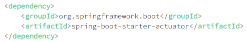
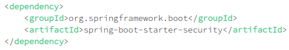
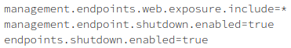

## Buildtool

Como herramienta de construcción he empleado Apache Maven. Al usar Spring Boot, podría haberme decidido tanto por Gradle como Maven. Me decidí por la segunda porque quería aprender un poco más ya que con Gradle he trabajado con anterioridad.

### Start & Stop

#### Opción 1
En la primer lugar, usé el comando que se usa por defecto para lanzar la aplicación:

`$ mvn spring-boot:run`

Para detenerla, la opción más fácil es usar un endpoint. 
Para ello hay que añadir dependencias y una directiva a *application.properties*.

De forma adicional, se puede añadir seguridad a nuestra aplicación para poder acceder mediante un
sistema de login.

Por último, modificamos el *application.properties*.

Para detener nuestra aplicación solo debemos realizar una petición usando POST.

`curl -X POST localhost:port/actuator/shutdown`

#### Opción 2

Cambiando el fichero *pom.xml* y añadiendo las siguientes directivas podemos evitar el uso del endpoint:

~~~
<plugin>   
    <groupId>org.springframework.boot</groupId>   
    <artifactId>spring-boot-maven-plugin</artifactId>
    <configuration>
         <executable>true</executable>
        <fork>true</fork>
        <addResources>true</addResources>
        <!-- <jvmArguments> -->
        <!-- -agentlib:jdwp=transport=dt_socket,address=localhost:5005,server=y,suspend=n -->
        <!-- </jvmArguments> -->
    </configuration>
</plugin>
~~~

El plugin de Maven para Spring Boot se encarga del resto de la configuración. Después de incluir estas directivas hay que ejecutar `$ mvn clean`. Para iniciar la aplicación usamos 
`$ spring-boot:start &` que deja la aplicación corriendo en segundo plano. Para detenerla se usa 
`$ spring-boot:stop`..

#### Ejecutar test

De nuevo Maven nos lo pone bastante fácil. Si queremos pasar todos los tests ejecutamos:

`mvn test`

Lo que hará será buscar todas las clases que incluyan en su nombre test/s o Test/s 
y ejecutar todas sus funciones.

Supongamos ahora que queremos ejecutar los tests de una clase específica.

`mvn -Dtest=PlayfyTests test`

A la derecha del igual podemos incluir la  clase a testear y se ejecutarán todos sus tests.

Tratemos ahora de ejecutar un solo test de la clase anteriórmente testeada:

`mvn -Dtest=PlayfyTests#testUpdateSong test`

Símplemente tenemos que añadir # y el nombre de la función que deseemos testear.

## Bibliografía

1ª opción:
  - https://www.baeldung.com/spring-boot-shutdown
  - https://stackoverflow.com/questions/38377156/how-to-stop-a-spring-boot-service-from-command-line

2ª opción:
  - https://stackoverflow.com/questions/45960578/spring-boot-maven-plugin-stop-goal

Tests:
  - https://www.mkyong.com/maven/how-to-run-unit-test-with-maven/