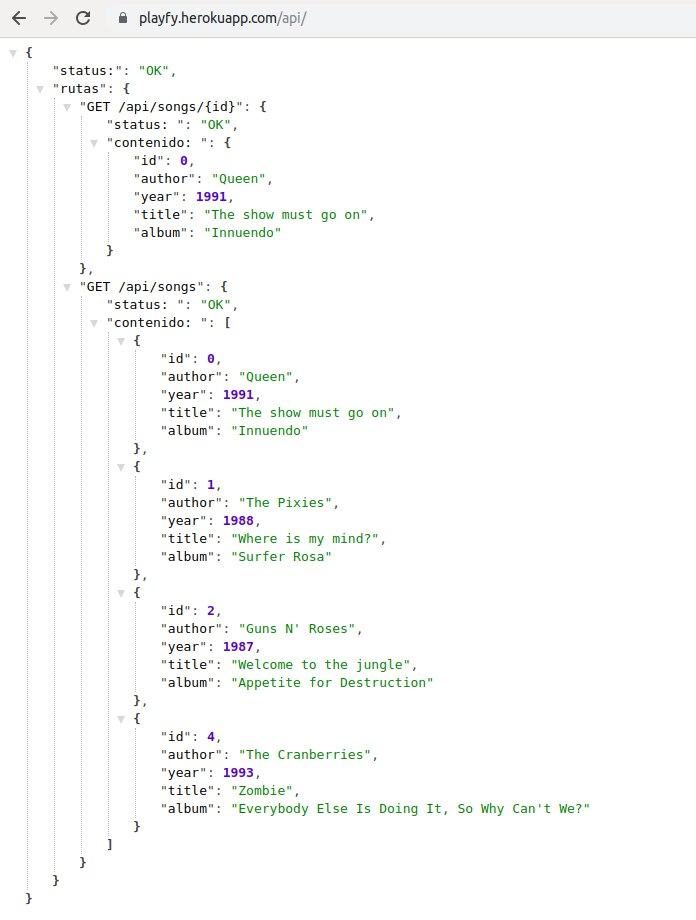
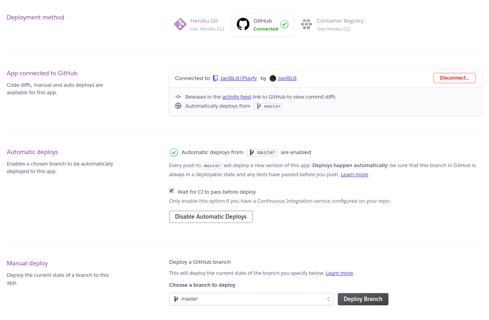
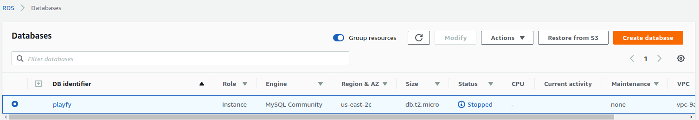

### Elección

Como PaaS elegí Heroku por varios motivos:

- Su uptime es de 99.999091% en la región europea.  

- Soporta Java.   

- Tiene un plan gratuito.  

- Se integra con git y github.  

- Si en un momento se necesitan más recursos, se pueden añadir fácilmente.  

- Capacidad de provisionamiento, y rollback de la aplicación.

- Fácil y rápido despliegue.

También intenté desplegar en otros PaaS, dejo documentación para AppEngine de Google [aquí](despliegue_appengine.md).

### Despliegue

Podemos distinguir entre dos formas de desplegar; usar el plugin de Maven o no.
Lo que es común es registrarse en [Heroku](https://www.heroku.com/) y descargarse la CLI de Heroku.

#### 1ª Sin plugin

Iniciar sesión en Heroku desde la terminal con `heroku login`.
Se abrirá una ventana en el navegador en la que se podrá iniciar sesión.

Podemos comprobar que la clave se ha añadido correctamente ejecutando `heroku keys`. Si la clave no estuviese ahí 
podemos añadirla con `heroku keys:add`.

Clonar este repositorio. 

~~~
heroku git:clone -a playfy 
cd playfy
~~~

Haz algunos cambios en el código que acabas de clonar y despliégalo usando:

~~~
git add .
git commit -am "make it better"
git push heroku master
~~~

Para abrir la app `heroku open`

#### 2ª Con plugin

Primero añadimos el plugin de heroku al *pom.xml*:

~~~
<project>
  ...
  <build>
    ...
    <plugins>
      <plugin>
        <groupId>com.heroku.sdk</groupId>
        <artifactId>heroku-maven-plugin</artifactId>
        <version>2.0.13</version>
      </plugin>
    </plugins>
  </build>
</project>
~~~

Creamos una aplicación con `heroku apps:create playfy`.

Ahora si, desplegamos con `mvn clean heroku:deploy`.

Para abrir la app `heroku open`

*Esta información ahora se muestra en /status*

#### GitHub

Una vez desplegada nuestra aplicación desde la web de Heroku podemos configurarla.

### Base de datos

Mi intención era también escoger un servicio para almacenar una base de datos que usara mi aplicación.
Elegí RDS de Amazon Web Services y para poder usarla añadí el endpoint de la base de datos.

## Bibliografía
Sin plugin
 - https://devcenter.heroku.com/articles/deploying-spring-boot-apps-to-heroku

Con plugin:
 - https://devcenter.heroku.com/articles/deploying-java-applications-with-the-heroku-maven-plugin