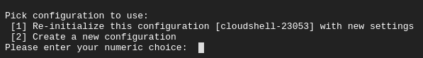
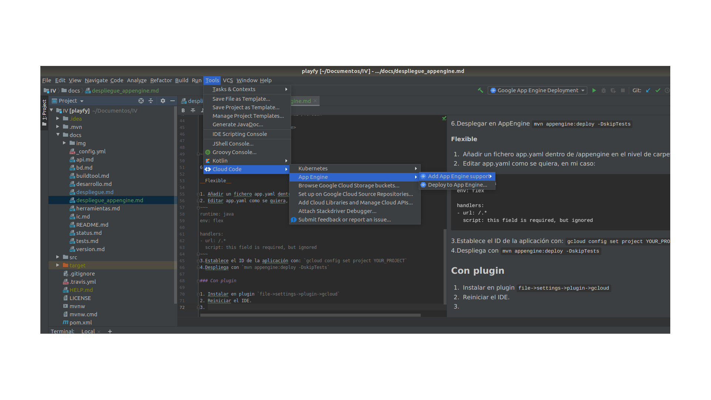

# Despligue App Engine
Finalmente no conseguí terminar de desplegar usando AppEngine pero dejo todas las 
opciones que estuve explorando.

A la hora de desplegar usando App Engine se pueden distinguir 3 formas posibles:

- Usar un plugin para el IDE (Intellij IDEA)
- Utilizar gcloud SDK
- Utilizar el shell que proporciona AppEngine en la web

Podemos elegir entre lo que Google llama ambientes.

- Flexible: Se ejecuta dentro de un contenedor docker.
- Estándar: Ejecuta las aplicaciones en un servidor de aplicación web jetty.

He probado los dos métodos y a continuación paso también a explicarlos.

### Gcloud

### Sin plugin
__Estandar__

1. Instalar el SDK de Google para Java en nuestro equipo `gcloud components update app-engine-java
`
2. Iniciar la configuración `gcloud init`
3. Se nos ofrecerá la opción de crear una nueva configuración o usar una ya existente. 
Seleccionamos crear una nueva configuración.

  Elegimos el nombre de la configuración y selecionamos el proyecto correspondiente.
4. Crear una app en AppEngine `gcloud app create`
5. Crear un directorio /web/WEBINF al nivel de directorio que /src y en su interior crear 
un fichero  appengine-web.xml.
~~~
$ mkdir -p src/main/webapp/WEB-INF/
$ touch src/main/webapp/WEB-INF/appengine-web.xml
~~~
6.Editar ese fichero con los parámetros que deseemos, en mi caso:
~~~
<!--appengine-web.xml->
<appengine-web-app xmlns="http://appengine.google.com/ns/1.0">
  <version>1</version>
  <threadsafe>true</threadsafe>
  <runtime>java8</runtime>
</appengine-web-app>
~~~
Este fichero se usará para generar el app.yaml del que hablaremos en el siguiente entorno.

7.Añadir el plugin de maven junto a sus dependencias.
~~~
<plugin>
   <groupId>com.google.appengine</groupId>
   <artifactId>appengine-maven-plugin</artifactId>
   <version>1.9.76</version>
</plugin>

<dependencyManagement>
        <dependencies>
            <dependency>
                <groupId>org.springframework.cloud</groupId>
                <artifactId>spring-cloud-dependencies</artifactId>
                <version>Greenwich.RC2</version>
                <type>pom</type>
                <scope>import</scope>
            </dependency>
        </dependencies>
    </dependencyManagement>
~~~

8.Desplegar en AppEngine `mvn appengine:deploy -DskipTests`

Cuando añadimos -DskipTests queremos indicar que no pase los tests. Aunque si quisiésemos
pasarlos solo tendriamos que eliminar esa parte.

__Flexible__

1. Añadir un fichero app.yaml dentro de /appengine en el nivel de carpeta de src.
2. Editar app.yaml como se quiera, en mi caso: 
~~~
runtime: java
env: flex

handlers:
- url: /.*
  script: this field is required, but ignored
~~~
3.Establece el ID de la aplicación con: `gcloud config set project YOUR_PROJECT`
4.Despliega con `mvn appengine:deploy -DskipTests`

### Con plugin 

1. Instalar en plugin `file->settings->plugin->gcloud`
2. Reiniciar el IDE.
3. Seleccionar el ambiente que queremos

4. Seleccionar proyecto y logearse en Google Cloud.
5. En función del entorno que hayamos elegido seguimos los pasos de creación del fichero de
configuración y seleccionamos deploy.

### Bibliografía
https://cloud.google.com/code/docs/intellij/deploy-flex  
https://www.youtube.com/watch?v=bpKrcmSgdmk  
https://cloud.google.com/java/samples?hl=es-419  
https://github.com/GoogleCloudPlatform/getting-started-java/tree/master/helloworld-springboot  
https://medium.com/google-cloud/getting-started-with-google-app-engine-and-spring-boot-in-5-steps-2d0f8165c89  
https://medium.com/adamo.fig/spring-boot-y-google-cloud-sql-cloud-app-engine-la-forma-m%C3%A1s-f%C3%A1cil-ca1c3f5a051  