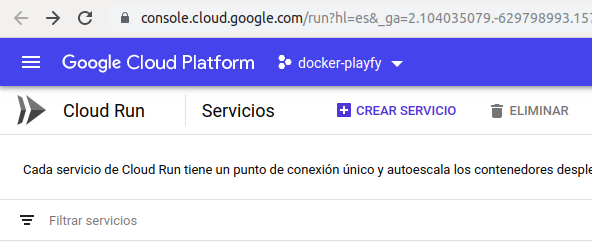
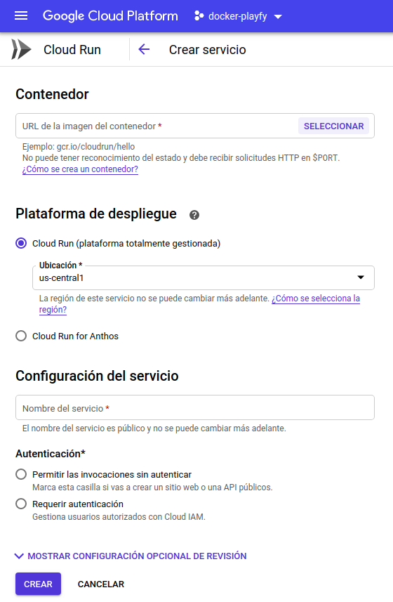
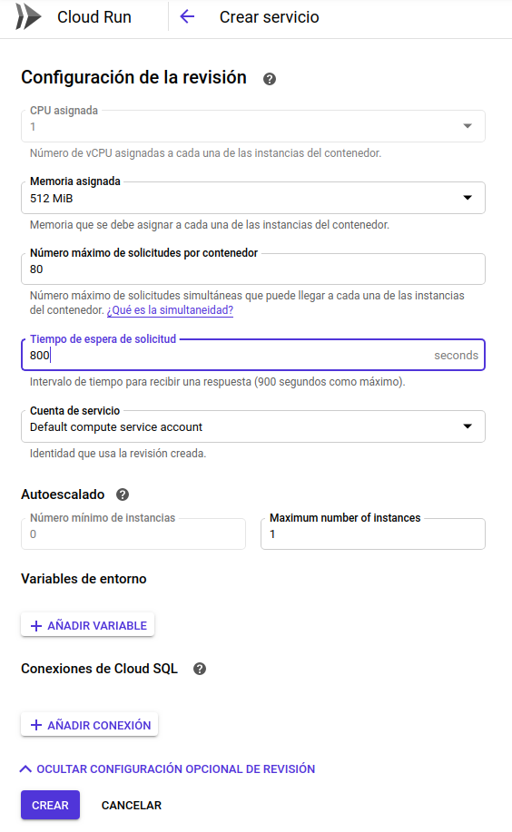
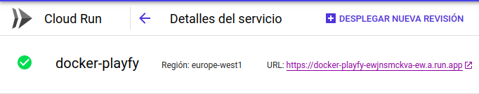

## Despliegue del contenedor en Cloud Run

Para poder desplegar un contenedor en Google Run previamente tenemos que hacer push de
nuestra imagen a **Container Registry**. Este es un servicio de Google que nos permite
almacenar contenedores y realizar operaciones sobre ellos.

### Push a Cloud Registry

> Requisitos:
>   - Tener instalado el SDK de Google (Hay más formas de hacerlo, yo lo haré así)
>   - Activar la facturación en el proyecto
>   - Docker instalado y añadido el usuario al grupo docker. `sudo usermod -a -G docker ${USER}`
>   - Tener permisos de push y pull del registro
>   - Configuar docker para usar gcloud. `gcloud auth configure-docker`

1. Darle un tag a la imagen local con el nombre del registro.  
`docker tag [SOURCE_IMAGE] [HOSTNAME]/[PROJECT-ID]/[IMAGE]:[TAG]`   
Para saber que HOSTNAME usar podemos consultar la [documentación](https://cloud.google.com/container-registry/docs/pushing-and-pulling)  
En mi caso:  
`docker tag docker-image gcr.io/docker-playfy/docker-playfy`

2. Hacer el push.  
`docker push [HOSTNAME]/[PROJECT-ID]/[IMAGE]:[TAG]`   
En mi caso:   
`docker push docker-image gcr.io/docker-playfy/docker-playfy` 

### Desplegar en Cloud Run
Cloud Run es una evolución de AppEngine que permite correr cualquier 
lenguage de backend sobre un contenedor de Docker. 

[Antes de continuar, tenemos que activar las APIs para no tener problemas con 
Cloud Run](https://support.google.com/googleapi/answer/6158841?hl=en)

1. Habilitar Cloud Run. Para ello ir a https://cloud.google.com/run/?hl=es
2. Crear servicio. 
3. Rellenar los campos. En contenedor seleccionamos la url de nuestro contenedor,
en plataforma de despliegue seleccionamos cloud run, en configuración del servicio 
le damos nombre a nuestro servicio y seleccionamos permitir las invocaciones sin autorizar.

4. Si diésemos a crear nos fallaría. Esto se debe a que aún tenemos que configurar opciones.
Clickamos a *mostrar configuración opcional de revisión*. El problema viene de parte de la
memoria asignada, la ponemos a 512 Mib, adicionalmente establecemos el tiempo de espera en 
800 segundos(esto no es obligatorio), finalmente como queremos ahorrar costes establecemos,
el número máximo de instancias a 1. Si dejásemos esto último a 1000 se crearían instacias
automáticamente si el sistema empezase a saturarse para equilibrar la carga.

5. Finalmente damos a crear.

### Bibliografía
  - https://cloud.google.com/container-registry/docs/pushing-and-pulling
  - https://carlosazaustre.es/google-cloud-run/