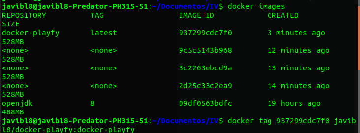
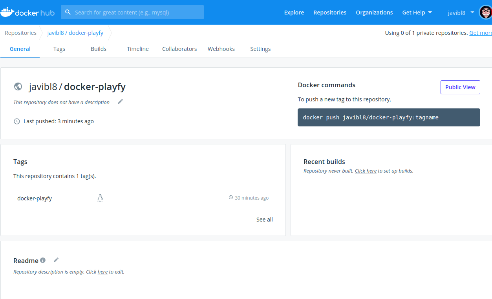

## DockerHub

### ¿Cómo hacer push de nuestra imagen a DockerHub?

> Previamente tenemos que crear nuestra imagen.

1.- Nos logeamos con `docker login`.

2.- Visualizamos las imágenes que tenemos y le ponemos un tag con:

`docker tag YOUR_IMAGE_ID YOUR_HUB_USERNAME/YOUR_IMAGE_NAME:YOUR_TAG`

3.- Realizamos el push. Para ello: `docker push YOUR_HUB_USERNAME/YOUR_IMAGE_NAME`

### ¿Cómo hacer pull de una imagen de DockerHub?

`docker pull USERNAME/IMAGE_NAME`
