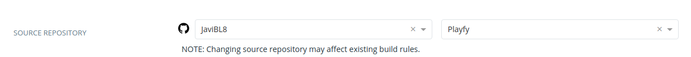
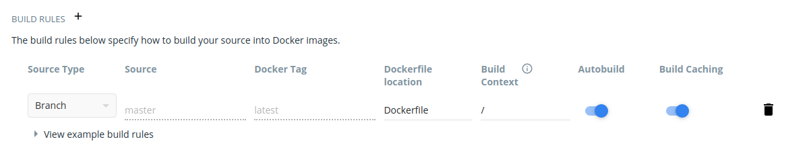

## DockerHub

### ¿Cómo hacer push de nuestra imagen a DockerHub?

> Previamente tenemos que crear nuestra imagen.

1.- Nos logeamos con `docker login`.

2.- Visualizamos las imágenes que tenemos y le ponemos un tag con:

`docker tag YOUR_IMAGE_ID YOUR_HUB_USERNAME/YOUR_IMAGE_NAME:YOUR_TAG`

3.- Realizamos el push. Para ello: `docker push YOUR_HUB_USERNAME/YOUR_IMAGE_NAME`

### ¿Cómo hacer pull de una imagen de DockerHub?

`docker pull USERNAME/IMAGE_NAME`

### ¿Cómo activar autobuild?
El autobuild consiste en actualizar el repositorio que contiene nuestra imagen
cada vez que se realice un push en la rama master del repositorio del proyecto en 
GitHub.

Para activarlo, en primer lugar seleccionamos nuestro proyecto y vamos a **build**. 
Ahora permitimos el acceso a GitHub y finalmente seleccionamos nuestro repositorio.

Por defecto, después de esto se activa el autobuild. Si no fuese el caso, más abajo
podemos comprobarlo.

### Bibliografía
 - https://docs.docker.com/docker-hub/builds/
 - https://ropenscilabs.github.io/r-docker-tutorial/04-Dockerhub.html