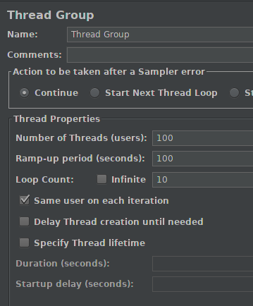

## Configuración de Vagrant

### Elección del SO

He elegido Ubuntu 16.04 LTS(Long Term Support) porque tiene actualizaciones más periódicas que
el 16.10 y porque es más estable. He realizado un test de carga con JMeter para evaluar el
rendimiento.

Para ello creo 100 hilos que irán creando más cada 100 segundos.

Los resultados que obtuve fueron estos: 

### Vagrantfile
He eliminado comentarios por defecto para facilitar su comprensión

~~~
# -*- mode: ruby -*-
# vi: set ft=ruby :

Vagrant.configure("2") do |config|
  config.vm.box = "ubuntu/xenial64"
  config.ssh.forward_agent = true
  config.vm.network "forwarded_port", guest: 8080, host: 8080

  #ANSIBLE
  config.vm.provision "ansible", run: "always" do |ansible|
	  ansible.playbook = "playbook.yml"
  end

  #EJECUTAR PLAYFY
  config.vm.provision "shell",
    inline: "cd Playfy; ./mvnw spring-boot:start &",
      run: "always"
end

~~~

Para poder acceder por ssh sin necesidad de hacer `vagrant ssh` he usado 
config.ssh.forward_agent que junto a las instrucciones que expliqué del playbook
permite acceder con `ssh vagrant@127.0.0.1 -p 2222`. Esto será útil para el despliegue.

Además he realizado un forwarded port para que el puerto 8080 de la MV sea el 8080
del host.

He usado provisionamiento múltiple y en primer lugar se ejecuta el playbook.yml de Ansible
y en segundo lugar lanzo mi microservicio con el shell. Si quisiéramos ejecutar solo uno
de los dos podríamos hacerlo con `vagrant provision --provision-with ansible` por ejemplo.

### Bibliografía

 - https://github.com/hashicorp/vagrant/issues/9015
 - https://www.blazemeter.com/blog/jmeter-ramp-up-the-ultimate-guide/
 - https://ubuntu-mate.community/t/difference-between-16-04-vs-16-10/11958/3
 - https://www.vagrantup.com/docs/vagrantfile/
 - https://www.vagrantup.com/docs/provisioning/basic_usage.html
 - https://stackoverflow.com/questions/10864372/how-to-ssh-to-vagrant-without-actually-running-vagrant-ssh